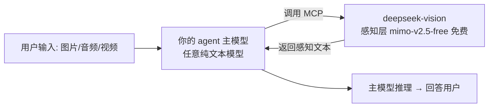

# DeepSeek Vision · 给纯文本主模型做"眼睛"

> **"你的模型没有视觉？那就给它一双免费的'眼睛'。"**
> 无论你在 Codex / Claude Code / Cursor / VS Code / opencode 里用的是什么主模型（哪怕纯文本模型、自定义 baseURL 的模型），
> 装上这个 MCP + Skill，图片 / 音频 / 视频 都能直接"看"——**由免费的 MiMo-V2.5 Free 感知，推理还是你的主模型自己来**。
> 只需填入你自己的 opencode zen API key。

## 🏗 架构



- **感知层（眼睛）**：免费多模态 `mimo-v2.5-free`，走**你自己的** opencode zen API key，把媒体变成文本描述
- **推理层（大脑）**：**你的主模型** —— 你已经在 agent 客户端用上了，感知结果直接喂给它即可
- 本 MCP 只做感知、不绑死任何推理模型，因此**与你现有的任何主模型/自定义 baseURL 天然兼容**

## 🚀 安装（全局一次安装，所有项目通用）

### 方式一：一键安装（推荐）

**把下面这句话复制给任意 agent 客户端**（Codex / Claude Code / Cursor / VS Code / opencode…），AI 会自动完成全部配置：

```
请帮我安装 deepseek-vision（多模态感知 MCP + Skill，全局安装，所有项目通用）：
git clone https://github.com/Sunlianwang/deepseek-vision deepseek-vision && cd deepseek-vision && ./install.sh
```

> Windows 用户把 `./install.sh` 换成 `powershell -ExecutionPolicy Bypass -File install.ps1`。

安装脚本会：
1. 让你填入 opencode zen API key（或复用已有配置）
2. **全局存储 key** 到 `~/.deepseek-vision/.env`（一次配置，所有项目共用）
3. 安装依赖
4. 注册 MCP 到检测到的客户端（VS Code / Cursor / Claude Code / opencode）
5. 安装 Skill 到全局 Skill 目录

**之后你新建或切换任何项目，MCP 和 Skill 都自动可用，无需重复安装。**

### 方式二：手动全局注册（各客户端）

如需手动配置，各客户端的全局 MCP 注册方式见 [`config-examples/CLIENTS.md`](config-examples/CLIENTS.md)。

关键区别：**全局配置 vs 项目级**

| 内容 | 存储位置 | 说明 |
|---|---|---|
| API key | `~/.deepseek-vision/.env` | 全局一份，所有项目共用 |
| MCP 注册 | 各客户端全局配置 | VS Code: `AppData\Code\User\mcp.json`，Cursor: `~/.cursor/mcp.json` 等 |
| Skill | 各客户端全局 skill 目录 | 一次安装，所有项目可用 |

> 项目级 `.env` 作为兼容保留——如果项目有特殊需求（如不同 key），可覆盖全局配置。

## 🛠 工具（6 个，全部只做感知）

| 工具 | 说明 |
|---|---|
| `hybrid_analyze` | **万能入口**：自动识别图片/音频/视频 → 感知 → 返回感知文本 |
| `analyze_image` / `transcribe_audio` / `analyze_video` | 分媒体类型专用（视频需本机 ffmpeg） |
| `list_models` / `zen_status` | 模型列表 / 配置与连通性自检 |

> 感知返回的文本会附注"以上为多模态感知结果，请作为上下文由主模型完成推理回答"，
> agent 拿到后直接用你的主模型继续思考，无需切换模型。

## 📁 结构

```
├── install.sh / install.ps1    # 一键安装（核心）
├── mcp-deepseek-vision/        # MCP Server（Node.js 纯 ESM，零构建，仅感知层）
│   ├── src/                    #   config / zen / media / tools / index
│   └── test/                   #   API 实测 + MCP 握手实测
├── skill/                      # Skill（opencode/claude/agents 三兼容 + vscode/cursor 版）
├── config-examples/CLIENTS.md  # 全部客户端手动接入指南
├── AGENTS.md                   # codex/cc-haha/kilo/workbuddy 等通用规则
└── .env                        # 你的 opencode zen key（已 gitignore）
```

## ⚙️ 配置（`.env`）

| 变量 | 默认值 | 说明 |
|---|---|---|
| `OPENCODE_API_KEY` | 必填 | 你自己的 opencode zen key，获取 https://opencode.ai/auth |
| `OPENCODE_BASE_URL` | `https://opencode.ai/zen/v1` | 感知端点（OpenAI 兼容） |
| `MULTIMODAL_MODEL` | `mimo-v2.5-free` | 感知模型（免费多模态） |
| `AUDIO_MODEL` / `VIDEO_MODEL` | 跟随 MULTIMODAL_MODEL | 分媒体类型指定模型 |
| `MAX_MEDIA_MB` / `VIDEO_FRAMES` | `20` / `4` | 大小上限 / 抽帧数 |

## 🧪 已实测（本人 opencode zen key）

✅ 60 模型可用 · ✅ MiMo 图像感知准确（读出全部文字与元素）· ✅ MCP 握手 · ✅ 全链路（图→感知文本返回）

## ❓ FAQ

- **我用的主模型是纯文本的，能行吗？** 能。感知发生在 MCP 内部，返回的永远是文本，任何主模型都能用。
- **我想用自己的 baseURL + API 做主模型？** 完全支持——推理本来就是你客户端主模型的事，本 MCP 不参与，你无需在这里配置任何推理信息。
- **key 安全？** 只存 `.env`（gitignore），`zen_status` 脱敏显示。
- **视频报 ffmpeg？** 安装 ffmpeg 加入 PATH，或用 `analyze_image` 逐帧分析。
- **换更强的视觉模型？** `.env` 改 `MULTIMODAL_MODEL`（`list_models` 可查 zen 支持的模型）。

## 📄 许可

MIT
