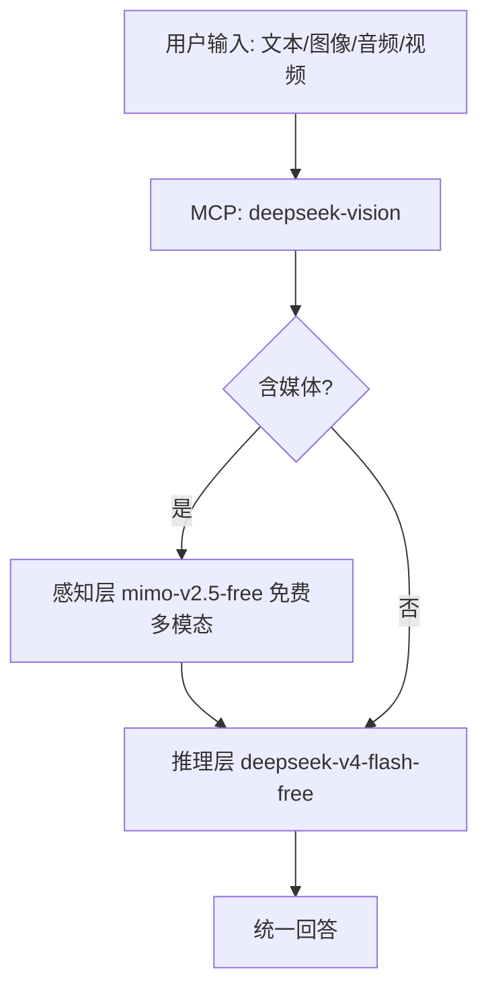

# DeepSeek Vision · 多模态 MCP + Skill

> **"DeepSeek 没有视觉？给它一双免费的'眼睛'。"**
> 感知层用免费的 **MiMo-V2.5 Free**，推理层用 **DeepSeek V4 Flash**。
> 文本 / 图像 / 音频 / 视频全部通过 DeepSeek 统一工作，**无需切换模型**。
> 通用于 Codex / Claude Code / Cursor / VS Code / opencode / cc-haha / Trae / WorkBuddy / Kilo / Windsurf / Copilot。

## 🚀 一键安装

**把下面这句话复制给任意 agent 客户端**（Codex / Claude Code / Cursor / VS Code / opencode…），AI 会自动完成克隆 → 装依赖 → 配置 key → 注册 MCP → 安装 Skill：

```
请帮我安装 deepseek-vision（多模态 MCP + Skill）：
git clone <你的GitHub仓库地址> deepseek-vision && cd deepseek-vision && ./install.sh
```

> Windows 用户把 `./install.sh` 换成 `powershell -ExecutionPolicy Bypass -File install.ps1`。
> 也可以直接自己跑：
> ```bash
> git clone <你的GitHub仓库地址> deepseek-vision && cd deepseek-vision && ./install.sh
> ```

安装脚本会：
1. 让你填入 opencode zen API key（或环境变量 `OPENCODE_API_KEY`）
2. 生成 `.env`（key 只存本地）
3. 安装依赖
4. 自动注册 MCP 到检测到的客户端（VS Code / Cursor / opencode / Claude Code / Codex）
5. 安装 Skill 到 `.opencode/skills/`、`.claude/skills/`、`.agents/skills/`

完成后直接对 agent 说：**"分析这张图 / 转写这段音频 / 看这个视频 / 用 DeepSeek 重构这段代码"** 即可。

## 🏗 架构



- **感知层**（默认 `mimo-v2.5-free`，免费）：图像/音频/视频 → 结构化描述
- **推理层**（默认 `deepseek-v4-flash-free`，免费）：基于感知结果深度推理
- 全部走 opencode zen API（OpenAI 兼容端点 `https://opencode.ai/zen/v1`），key 只存本地 `.env`
- **BYOK**：推理/感知可分别指向任意 OpenAI 兼容端点（DeepSeek 官方、OpenRouter…），见 [`config-examples/CLIENTS.md`](config-examples/CLIENTS.md)

## 🛠 工具

| 工具 | 说明 |
|---|---|
| `hybrid_analyze` | **万能入口**：自动识别图片/音频/视频/文本 → 感知 → DeepSeek 推理 |
| `analyze_image` / `transcribe_audio` / `analyze_video` | 分媒体类型专用（视频需本机 ffmpeg） |
| `deepseek_think` | 纯文本 DeepSeek 推理 |
| `list_models` / `zen_status` | 模型列表 / 配置与连通性自检 |

## 📁 结构

```
├── install.sh / install.ps1    # 一键安装（核心）
├── mcp-deepseek-vision/        # MCP Server（Node.js 纯 ESM，零构建）
│   ├── src/                    #   config / zen / media / tools / index（共约 300 行）
│   └── test/                   #   API 实测 + MCP 握手实测
├── skill/                      # Skill（opencode/claude/agents 三兼容 + vscode/cursor 版）
├── config-examples/CLIENTS.md  # 全部客户端手动接入指南
├── AGENTS.md                   # codex/cc-haha/kilo/workbuddy 等通用规则
└── .env                        # 你的 key（已 gitignore）
```

## ⚙️ 配置（`.env`）

| 变量 | 默认值 | 说明 |
|---|---|---|
| `OPENCODE_API_KEY` | 必填 | opencode zen key，获取 https://opencode.ai/auth |
| `OPENCODE_BASE_URL` | `https://opencode.ai/zen/v1` | 统一端点 |
| `MULTIMODAL_MODEL` / `TEXT_MODEL` | `mimo-v2.5-free` / `deepseek-v4-flash-free` | 感知层 / 推理层模型 |
| `MULTIMODAL_BASE_URL` / `TEXT_BASE_URL` | 跟随 OPENCODE_BASE_URL | 分端点（换厂商） |
| `MAX_MEDIA_MB` / `VIDEO_FRAMES` | `20` / `4` | 大小上限 / 抽帧数 |

## 🧪 已实测（本人 opencode zen key）

✅ 60 模型可用 · ✅ MiMo 图像识别准确 · ✅ DeepSeek 免费推理 · ✅ MCP 握手 · ✅ 全链路（图→感知→推理）

## ❓ FAQ

- **付费版 DeepSeek？** `.env` 把 `TEXT_MODEL` 改为 `deepseek-v4-flash`（需绑定支付方式）。
- **视频报 ffmpeg？** 安装 ffmpeg 加入 PATH，或用 `analyze_image` 逐帧分析。
- **key 安全？** 只存 `.env`（gitignore），`zen_status` 脱敏显示。

## 📄 许可

MIT
